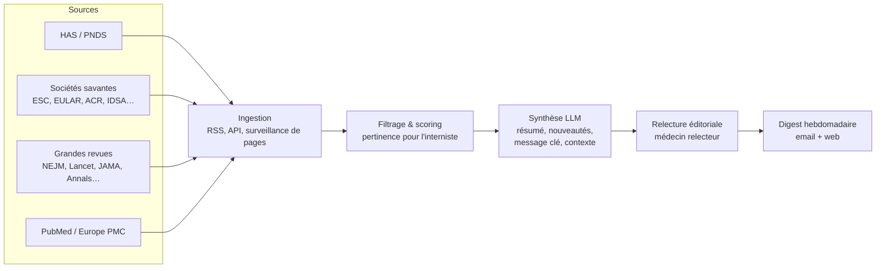

# ThisWeek — La veille hebdomadaire de l'interniste

**ThisWeek** est un projet de service de veille médicale automatisée destiné aux
médecins internistes (et à terme à d'autres spécialités) : chaque semaine, une
synthèse des **nouvelles recommandations, guidelines, PNDS et articles
importants**, avec pour chaque item :

- un **résumé** structuré,
- **ce qui est nouveau** par rapport à la version / pratique antérieure,
- le **message à retenir** pour la pratique,
- une **mise en contexte** (place dans la littérature, niveau de preuve, controverses).

En bref : la fraîcheur d'une veille PubMed, la lisibilité d'UpToDate, le format
d'une newsletter.

## Documents de conception

| Document | Contenu |
|---|---|
| [docs/01-concept.md](docs/01-concept.md) | Vision produit, personas, proposition de valeur, positionnement |
| [docs/02-sources.md](docs/02-sources.md) | Inventaire des sources (HAS, PNDS, sociétés savantes, revues) et modes d'accès |
| [docs/03-architecture.md](docs/03-architecture.md) | Pipeline technique : ingestion → tri → synthèse LLM → relecture → diffusion |
| [docs/04-mvp-roadmap.md](docs/04-mvp-roadmap.md) | Feuille de route par phases, du prototype au produit |
| [docs/05-risques-conformite.md](docs/05-risques-conformite.md) | Droit d'auteur, responsabilité médicale, RGPD, qualité |
| [docs/exemple-digest.md](docs/exemple-digest.md) | Maquette d'un numéro hebdomadaire type |

## L'idée en une image



## Le site

Le dépôt contient un site statique complet qui publie les numéros hebdomadaires.

```bash
pip install pyyaml jinja2 markdown

# Générer le site dans dist/ (dernier numéro, archives, méthode, RSS)
python3 site/build.py

# Préparer le brouillon de la semaine : candidats PubMed des 7 derniers jours
python3 pipeline/fetch_pubmed.py
```

Arborescence :

| Dossier | Rôle |
|---|---|
| `content/issues/*.yaml` | Un fichier par numéro publié (schéma illustré par le numéro 0 de démonstration) |
| `content/methode.md` | Page « Méthode » (sélection, transparence IA, limites) |
| `content/drafts/` | Brouillons hebdomadaires générés depuis PubMed (non versionnés) |
| `site/` | Générateur (`build.py`), templates Jinja2, feuille de style |
| `pipeline/` | Collecte des candidats (PubMed E-utilities) |
| `prompts/` | Prompts de scoring et de synthèse pour préparer les numéros |
| `.github/workflows/deploy.yml` | Construction et déploiement GitHub Pages à chaque push sur `main` |

### Publier un nouveau numéro

1. `python3 pipeline/fetch_pubmed.py` → trier les candidats du brouillon
   (compléter avec la veille HAS/PNDS/sociétés savantes).
2. Rédiger les synthèses avec `prompts/synthese.md`, **faire relire par un
   médecin**.
3. Créer `content/issues/AAAA-MM-JJ.yaml` (copier la structure d'un numéro
   existant). Retirer `brouillon: true` une fois la relecture médicale faite.
4. `python3 site/build.py` pour vérifier, puis pousser : le site se déploie
   tout seul.

Chaque numéro YAML peut porter deux drapeaux facultatifs : `demo: true`
(contenu fictif d'illustration) et `brouillon: true` (publications réelles,
synthèses rédigées à partir des abstracts mais pas encore relues par un
médecin). Chacun affiche une bannière dédiée.

## Statut

Site fonctionnel avec trois numéros rétrospectifs (n° 1 à 3, semaines de fin
juin à début juillet 2026), rédigés à partir de vraies publications PubMed et
signalés comme brouillons en attente de relecture médicale. Le périmètre est
strictement celui de la **médecine interne telle qu'elle se pratique en France**
(maladies auto-immunes et systémiques, vascularites, hématologie non maligne,
MTEV, sarcoïdose, amylose…) — voir la page Méthode. Les documents de conception
ci-dessus restent la référence pour les phases suivantes (automatisation du
scoring et des synthèses).
