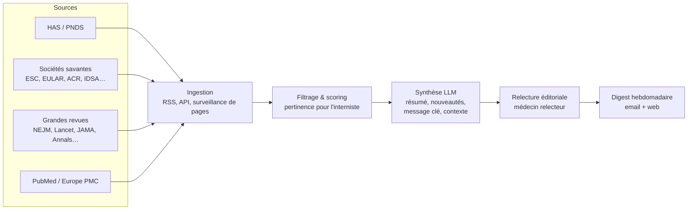

# ThisWeek — La veille hebdomadaire de l'interniste

**ThisWeek** est un projet de service de veille médicale automatisée destiné aux
médecins internistes (et à terme à d'autres spécialités) : chaque semaine, une
synthèse des **nouvelles recommandations, guidelines, PNDS et articles
importants**, avec pour chaque item :

- un **résumé** structuré,
- **ce qui est nouveau** par rapport à la version / pratique antérieure,
- le **message à retenir** pour la pratique,
- une **mise en contexte** (place dans la littérature, niveau de preuve, controverses).

En bref : la fraîcheur d'une veille PubMed, la lisibilité d'UpToDate, le format
d'une newsletter.

## Documents de conception

| Document | Contenu |
|---|---|
| [docs/01-concept.md](docs/01-concept.md) | Vision produit, personas, proposition de valeur, positionnement |
| [docs/02-sources.md](docs/02-sources.md) | Inventaire des sources (HAS, PNDS, sociétés savantes, revues) et modes d'accès |
| [docs/03-architecture.md](docs/03-architecture.md) | Pipeline technique : ingestion → tri → synthèse LLM → relecture → diffusion |
| [docs/04-mvp-roadmap.md](docs/04-mvp-roadmap.md) | Feuille de route par phases, du prototype au produit |
| [docs/05-risques-conformite.md](docs/05-risques-conformite.md) | Droit d'auteur, responsabilité médicale, RGPD, qualité |
| [docs/exemple-digest.md](docs/exemple-digest.md) | Maquette d'un numéro hebdomadaire type |

## L'idée en une image

## Statut

Phase de conception. Aucun code encore — les documents ci-dessus servent de
base de travail pour valider le concept, choisir le périmètre du MVP et
démarrer le développement.
