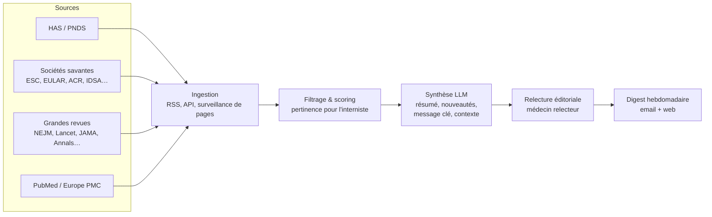

# ThisWeek — La veille hebdomadaire de l'interniste

**ThisWeek** est un projet de service de veille médicale automatisée destiné aux
médecins internistes (et à terme à d'autres spécialités) : chaque semaine, une
synthèse des **nouvelles recommandations, guidelines, PNDS et articles
importants**, avec pour chaque item :

- un **résumé** structuré,
- **ce qui est nouveau** par rapport à la version / pratique antérieure,
- le **message à retenir** pour la pratique,
- une **mise en contexte** (place dans la littérature, niveau de preuve, controverses).

En bref : la fraîcheur d'une veille PubMed, la lisibilité d'UpToDate, le format
d'une newsletter.

## Documents de conception

| Document | Contenu |
|---|---|
| [docs/01-concept.md](docs/01-concept.md) | Vision produit, personas, proposition de valeur, positionnement |
| [docs/02-sources.md](docs/02-sources.md) | Inventaire des sources (HAS, PNDS, sociétés savantes, revues) et modes d'accès |
| [docs/03-architecture.md](docs/03-architecture.md) | Pipeline technique : ingestion → tri → synthèse LLM → relecture → diffusion |
| [docs/04-mvp-roadmap.md](docs/04-mvp-roadmap.md) | Feuille de route par phases, du prototype au produit |
| [docs/05-risques-conformite.md](docs/05-risques-conformite.md) | Droit d'auteur, responsabilité médicale, RGPD, qualité |
| [docs/exemple-digest.md](docs/exemple-digest.md) | Maquette d'un numéro hebdomadaire type |

## L'idée en une image


```mermaid
flowchart LR
    subgraph Sources
        A1[HAS / PNDS]
        A2[Sociétés savantes<br/>ESC, EULAR, ACR, IDSA…]
        A3[Grandes revues<br/>NEJM, Lancet, JAMA, Annals…]
        A4[PubMed / Europe PMC]
    end
    B[Ingestion<br/>RSS, API, surveillance de pages]
    C[Filtrage & scoring<br/>pertinence pour l'interniste]
    D[Synthèse LLM<br/>résumé, nouveautés,<br/>message clé, contexte]
    E[Relecture éditoriale<br/>médecin relecteur]
    F[Digest hebdomadaire<br/>email + web]
    A1 --> B
    A2 --> B
    A3 --> B
    A4 --> B
    B --> C --> D --> E --> F
```

## Le site

Le dépôt contient un site statique complet qui publie les numéros hebdomadaires.

```bash
pip install pyyaml jinja2 markdown anthropic

# Générer le site dans dist/ (accueil, dernier numéro, archives, méthode, RSS)
python3 site/build.py

# Préparer le brouillon de la semaine : candidats PubMed des 7 derniers jours
python3 pipeline/fetch_pubmed.py

# Pipeline complet (sélection + synthèses par IA) — nécessite ANTHROPIC_API_KEY,
# jamais configurée en pratique : les numéros sont écrits à la main, voir plus bas
python3 pipeline/generate_issue.py
```

## Génération du numéro : déclenchement manuel, décision permanente

`ANTHROPIC_API_KEY` **ne sera jamais configurée** comme secret de dépôt. Le
workflow `.github/workflows/weekly-issue.yml` existe (il ferait tourner
`pipeline/generate_issue.py` : sélection PubMed, synthèse et vérification par
Claude, commit, build, déploiement), mais son déclenchement planifié est
**désactivé** — il ne reste que `workflow_dispatch` (bouton manuel), pour
éviter un échec rouge chaque semaine sans clé.

En pratique, chaque numéro est produit **à la main, dans une session Claude
Code** (skill `/mise-a-jour`) : recherche PubMed réelle, lecture des abstracts,
rédaction du YAML, `python3 site/build.py`, puis push. Le contenu (choix des
articles, synthèses) n'est **jamais relu ni modifié par un humain** — c'est un
parti pris assumé, affiché sur chaque numéro et sur la page Méthode — seul le
déclenchement de chaque numéro est manuel. La lecture du texte intégral se
limite aux articles en accès ouvert (PubMed Central, Europe PMC, Unpaywall en
repli) ; les articles sous abonnement sont résumés à partir de l'abstract, ce
qui est signalé.

Arborescence :

| Dossier | Rôle |
|---|---|
| `content/issues/*.yaml` | Un fichier par numéro publié ; `contexte` est une **liste de paragraphes** (bloc déroulable) |
| `content/methode.md` | Page « Méthode » (sélection, transparence IA, limites) |
| `content/drafts/` | Brouillons hebdomadaires générés depuis PubMed (non versionnés) |
| `site/` | Générateur (`build.py`), templates Jinja2, feuille de style |
| `pipeline/` | Collecte des candidats (PubMed E-utilities) |
| `prompts/` | Prompts de scoring et de synthèse pour préparer les numéros |
| `.github/workflows/deploy.yml` | Construction et déploiement GitHub Pages à chaque push sur `main` |

### Publier un nouveau numéro

La procédure de référence est le skill Claude Code `/mise-a-jour`
(`.claude/skills/mise-a-jour/SKILL.md`) : recherche PubMed réelle (générale +
recommandations), lecture des abstracts, rédaction du YAML sans chiffre
inventé, `python3 site/build.py` pour valider, vérification en HTTP local,
puis push sur `main`. Aucune relecture médicale n'intervient sur le contenu —
voir la page Méthode pour ce parti pris.

## Statut

Site fonctionnel, 15 numéros publiés (semaines de mai à août 2026), rédigés à
partir de vraies publications PubMed. Le périmètre est strictement celui de la
**médecine interne telle qu'elle se pratique en France** (maladies auto-immunes
et systémiques, vascularites, hématologie non maligne, MTEV, sarcoïdose,
amylose…) — voir la page Méthode. Les documents de conception ci-dessus
retracent la vision initiale du projet ; certains détails (calendrier,
automatisation planifiée) ont depuis évolué vers un déclenchement manuel
permanent, voir la section précédente.
