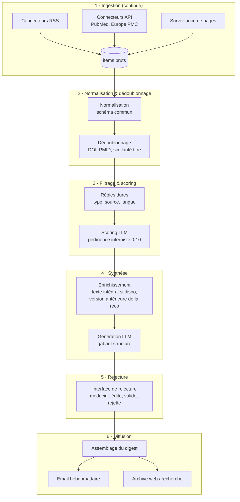

# 03 — Architecture technique

## Vue d'ensemble

Le système est un **pipeline hebdomadaire en 6 étapes**, chacune découplée des
autres par une base de données centrale. Tout item est tracé de bout en bout :
on doit toujours pouvoir répondre à « pourquoi cet item est-il (ou n'est-il
pas) dans le digest ? ».



## Modèle de données central

Une table `items` porte tout le cycle de vie :

```
item
├── identité : id, doi, pmid, url, titre, source_id, date_publication
├── contenu  : abstract, texte_integral (si accessible), metadonnees (auteurs, revue, type)
├── cycle    : statut = ingere → normalise → filtre_rejete | score
│              → synthese_generee → valide | rejete_relecture → publie
├── scoring  : score_pertinence, justification_llm, regle_declenchee
├── synthese : resume, ce_qui_change, message_cle, contexte, citations[]
└── audit    : horodatages, version_prompt, modele_llm, relecteur, edits_relecteur
```

Points importants :

- **`citations[]`** : chaque section de la synthèse référence les passages
  sources (abstract, texte de la reco) qui la justifient. Indispensable pour
  la relecture rapide et la confiance.
- **`edits_relecteur`** : conserver le diff entre la synthèse générée et la
  version validée — c'est le jeu de données qui permettra d'améliorer les
  prompts (et de mesurer si la relecture devient plus légère avec le temps).

## Étape par étape

### 1. Ingestion

- Un connecteur par famille (RSS, PubMed, page-watch), configuré par le
  registre de sources (cf. [02-sources.md](02-sources.md)).
- Tourne en continu (cron toutes les 6 h), pas seulement le jour du digest —
  la surveillance de pages a besoin de fréquence pour dater correctement.
- Idempotent : ré-ingérer une source ne crée pas de doublons.

### 2. Normalisation & dédoublonnage

- Schéma pivot unique quel que soit le connecteur.
- Dédoublonnage à trois niveaux : DOI/PMID exact → URL canonique →
  similarité de titre (le même essai arrive souvent par la revue ET par
  PubMed ET par un communiqué de société savante). En cas de doublon, fusionner
  les provenances (un item vu par 3 canaux est probablement important —
  signal utilisable dans le scoring).

### 3. Filtrage & scoring — **le cœur du produit**

Deux étages :

1. **Règles dures (sans LLM)** : élimine ~80 % du bruit à coût nul.
   - Types de publication exclus (études animales, cas cliniques isolés,
     lettres…) ; sources à `pertinence_defaut: haute` court-circuitées
     (une reco HAS ou un PNDS passe toujours).
2. **Scoring LLM** : pour le reste, un appel LLM par item (titre + abstract)
   retourne un JSON : `score 0-10`, `themes[]`, `justification`,
   `change_la_pratique: bool`. Prompt versionné dans le repo.
   - Seuil d'inclusion réglable ; les items entre deux seuils vont en
     rubrique « aussi parus cette semaine » (liste brute, pas de synthèse).

**Évaluation dès le premier jour** : constituer un jeu de test de ~100 items
étiquetés à la main (pertinent / non pertinent pour un interniste) et mesurer
rappel/précision à chaque changement de prompt. Le rappel sur les items
« majeurs » doit être proche de 100 % — rater une reco HAS est la pire panne
du produit.

### 4. Synthèse LLM

- **Enrichissement préalable** : récupérer le texte intégral quand il est
  libre (Unpaywall/OpenAlex, PDF HAS/PNDS). Sinon, synthèse sur abstract
  seul, **et le dire explicitement** dans l'interface de relecture.
- **La section « ce qui change »** nécessite la version antérieure de la reco :
  le registre de sources garde en mémoire les versions précédentes connues
  (ex. reco ESC 2022 vs 2026). Quand elle n'est pas disponible, le LLM doit
  produire « première recommandation sur ce sujet » ou « version antérieure
  non analysée » — jamais inventer un diff.
- Gabarit de sortie structuré (JSON) : `resume`, `ce_qui_change`,
  `message_cle`, `contexte`, `niveau_preuve`, `citations[]`, `confiance`.
- **Règles anti-hallucination dans le prompt** : interdiction d'énoncer un
  chiffre (posologie, seuil, HR/RR) absent du texte source ; toute affirmation
  de la synthèse doit être rattachée à une citation ; en cas de doute le
  modèle doit le signaler (`confiance: faible`) plutôt que lisser.
- Deux appels valent mieux qu'un : un appel **génération**, puis un appel
  **vérification** (le modèle relit sa synthèse face au texte source et
  signale les affirmations non sourcées) avant la relecture humaine.

### 5. Relecture éditoriale

- Interface web minimale : liste des items de la semaine, synthèse générée en
  regard du texte source (citations surlignées), boutons
  éditer / valider / rejeter / rétrograder en « aussi parus ».
- **Au début, la relecture est non négociable** (cf.
  [05-risques-conformite.md](05-risques-conformite.md)). L'objectif du
  pipeline est de la rendre rapide (< 1 h/semaine), pas de la supprimer.
- Pour le tout premier prototype, l'« interface » peut être un simple
  document Markdown généré + édité à la main avant envoi.

### 6. Diffusion

- **Email** : le canal principal — les médecins lisent leurs mails, pas une
  app de plus. Template HTML sobre, lisible sur mobile, version texte.
  Prestataire d'emailing standard (Brevo, Mailjet, Postmark…).
- **Archive web** : chaque numéro publié en page web + recherche par thème /
  pathologie dans les anciens items. C'est ce qui transforme la newsletter en
  base de connaissance (l'aspect « UpToDate » : retrouver « la reco lupus la
  plus récente » en deux clics).
- Boucle de retour : 👍/👎 par item dans l'email → alimente l'évaluation du
  scoring.

## Choix technologiques proposés (pragmatiques, révisables)

| Brique | Proposition | Pourquoi |
|---|---|---|
| Langage | **Python** | Écosystème parfait pour RSS (feedparser), PubMed (biopython/httpx), LLM, scraping |
| Base | **PostgreSQL** (SQLite au prototype) | Requêtes riches, full-text search intégré pour l'archive |
| Orchestration | **cron / GitHub Actions** au début, Prefect/Dagster si besoin | Un digest par semaine ne justifie pas d'infra lourde |
| LLM | **API Claude** (claude-sonnet-5 pour scoring, claude-opus / fable pour synthèse) | Qualité de synthèse et de suivi de consignes ; sorties structurées |
| Interface relecture | Markdown au prototype, puis petite app web (FastAPI + HTMX ou équivalent) | Minimalisme |
| Email | Brevo / Postmark | Standard, RGPD-compatible (hébergement UE pour Brevo) |
| Archive web | Site statique généré (Astro/Hugo) ou FastAPI | Chaque numéro est un document — le statique suffit longtemps |

## Coûts d'exploitation (ordre de grandeur)

- Volume hebdomadaire estimé après règles dures : 100–300 items à scorer
  (courts) + 10–20 synthèses (longues, avec vérification).
- Soit quelques dizaines d'euros par mois d'API LLM au tarif actuel — le coût
  marginal est négligeable ; le vrai coût est le temps de relecture humaine.

## Ce qui n'est PAS dans l'architecture (délibérément)

- Pas de chatbot ni de Q&A sur le corpus (phase ultérieure éventuelle).
- Pas de recommandation personnalisée par lecteur au MVP (un seul digest
  interniste ; la personnalisation par sous-thèmes viendra après).
- Pas de génération d'avis clinique : le système résume des documents, il ne
  répond jamais à une question clinique posée librement.
